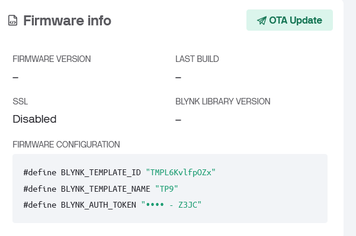

# Tugas Pendahuluan 9

Nama: Edgrant Henderson Suryajaya

NPM: 2206025016

---

## 1. Jelaskan bagaimana Blynk dapat digunakan untuk mengelola perangkat IoT secara real-time. Sertakan penjelasan mengenai arsitektur kerja Blynk (Cloud, App, dan Device) dan bagaimana bagian-bagian ini berkolaborasi untuk menciptakan ekosistem IoT yang terintegrasi. Berikan contoh implementasi nyata! (15 poin)

Blynk adalah platform IoT yang memungkinkan pengguna untuk membuat aplikasi IoT yang memiliki controler berbasi GUI. Blynk memungkinkan pengguna untuk mengontrol perangkat IoT secara real-time. Blynk memiliki 3 komponent utama yaitu Blynk Cloud, Blynk App, dan Blynk Device. Blynk Cloud adalah server yang digunakan untuk menyimpan data dan menghubungkan Blynk App dengan Blynk Device. Blynk App adalah aplikasi yang digunakan untuk mengontrol perangkat IoT. Blynk Device adalah alat yang digunakan untuk mengontrol perangkat IoT.

Blynk menggunakan dapat menggunakan protocol MQTT dan HTTPS untuk menghubungkan perangkat IoT dengan Blynk. Blynk menggunakan Virtual Pin untuk menghubungkan perangkat IoT dengan Blynk App. Virtual Pin adalah pin yang digunakan untuk mengirim data dari perangkat IoT ke Blynk App. Virtual Pin memungkinkan pengguna untuk mengirim data dari perangkat IoT ke Blynk App tanpa harus mengubah kode program pada perangkat IoT.

Referensi:

- Introduction | Blynk Documentation. (n.d.). https://docs.blynk.io/en
- Device | Blynk Documentation. (n.d.). https://docs.blynk.io/en/concepts/device
- Lee, Z. (2019, August 13). The Internet of Things: Getting Started with Blynk. TinyCircuits. https://tinycircuits.com/blogs/learn/getting-started-with-blynk

## 2. Protokol apa yang digunakan untuk komunikasi pada library Blynk? Jelaskan serta bandingkan dengan protokol layer 7 yang telah dipelajari pada modul sebelumnya! (10 poin)

Blynk menggunakan protokol Blynk Protocol untuk komunikasi antara Blynk App dan Blynk Device. Protocol ini bersifat properitary dan berbasis biner. Data yang dikirim protocol dapat dibagi menjadi 2, header dan body.

Header:

- Protocol Command: 1 byte
- Message ID: 2 bytes
- Body Length: 2 bytes

Body:

- Berupa string dengan ukuran 2^15 bytes

Referensi:

- Blynk Protocol | Blynk Documentation. (n.d.). https://docs.blynk.io/en/blynk-library-firmware-api/blynk-protocol
- Lee, Z. (2019, August 13). The Internet of Things: Getting Started with Blynk. TinyCircuits. https://tinycircuits.com/blogs/learn/getting-started-with-blynk

## 3. Virtual Pin sering digunakan dalam aplikasi Blynk. Jelaskan keuntungan menggunakan Virtual Pin dibandingkan Digital atau Analog Pin secara langsung. Dalam konteks keamanan dan efisiensi, kapan sebaiknya Virtual Pin digunakan? (10 poin)

Virtual pins adalah pin yang digunakan untuk mengirim data dari perangkat IoT ke Blynk App. Virtual pins memungkinkan pengguna untuk mengirim data dari perangkat IoT ke Blynk App tanpa harus mengubah kode program pada perangkat IoT.

Cara mengirim data ke Blynk App

```cpp
Blynk.virtualWrite(V1, 100); 
// V1 adalah Virtual Pin
// 100 adalah data yang dikirim
```

Cara membaca data dari Blynk App
```cpp
BLYNK_WRITE(V1) {
  int data = param.asInt();
}
```

BLYNK_WRITE tidak bisa digunakan di dalam function (termasuk main function), harus merupakan function sendiri.


Referensi:

- Virtual Pins | Blynk Documentation. (n.d.). https://docs.blynk.io/en/blynk-library-firmware-api/virtual-pins

## 4. Anda diminta merancang sebuah template IoT untuk memonitor suhu dan kelembaban ruangan menggunakan sensor DHT11 serta mengendalikan kipas angin secara otomatis.

### a. Jelaskan bagaimana Anda akan membuat template di Blynk.Console (field apa saja yang perlu diatur).

Step-step:

1. Pencet Developer Zone
2. Pencet New Template
3. Isi Nama, Deskripsi, Hardware (ESP32), dan connection type (WIFI)
4. Pencet Datastream
5. Pencet New Datastream

### b. Tentukan jenis data stream yang digunakan untuk tiap variabel (misalnya suhu, kelembapan, status kipas).

Pin V0: Suhu dari DHT

- Memasukkan Nama dan Alias
- Memassukan Pin (V0)
- Memasukkan Data Type (Double)
- Memasukkan Unit (Celsius)
- Memasuukan Min dan Max (-10, 50)

Pin V1: Kelembapan dari DHT

- Memasukkan Nama dan Alias
- Memassukan Pin (V1)
- Memasukkan Data Type (Double)
- Memasukkan Unit (%)
- Memasuukan Min dan Max (0, 100)

Pin 2: Kipas angin

- Memasukkan Nama dan Alias
- Memassukan Pin (2)
- Memasukkan Data Type (Integer)
- Memasukkan Unit (On/Off)
- Memasuukan Min dan Max (0, 1)

### c. Berikan alasan Anda memilih jenis data stream tersebut. (15 poin)

Suhu dipilih virtual pin karena suhu diperlukan untuk dimonitor dan mengatur kipas angin. Kelembapan dipilih virtual pin karena kelembapan diperlukan untuk dimonitor dan mengatur kipas angin. Kipas angin dipilih digital pin karena kipas angin tidak memerlukan data yang kompleks dan hanya memerlukan data on dan off.

Referensi:

- Introduction | Blynk Documentation. (n.d.). https://docs.blynk.io/en

## 5. Adaptasi tutorial yang ada pada video berikut (yang menggunakan ESP8266) sehingga dapat diimplementasikan pada ESP32. Screenshot tiap langkah-langkah yang Anda lakukan (termasuk sampai widget yang dibuat pada ponsel pintar Anda), sertakan kode dan juga skematik nya (Wokwi) (30 poin)

### Membuat Template Baru


### Menambahkan Datastream


### Menambahkan Switch pada Web Dashboard


### Membuat Device dengan Template


### Mencatat Firmware Configuration



### Pada PlatformIO, import library Blynk


### Memasukkan Firmware Configuration pada Kode

Refernsi Kode didapat dari link [ini](https://examples.blynk.cc/?board=ESP32&shield=ESP32%20WiFi&example=GettingStarted%2FVirtualPinRead)

```cpp
/* Fill-in information from Blynk Device Info here */
#define BLYNK_TEMPLATE_ID "censored"
#define BLYNK_TEMPLATE_NAME "TP9"
#define BLYNK_AUTH_TOKEN "censored"

/* Comment this out to disable prints and save space */
#define BLYNK_PRINT Serial

#define LED_PIN 4


#include <WiFi.h>
#include <WiFiClient.h>
#include <BlynkSimpleEsp32.h>

// Your WiFi credentials.
// Set password to "" for open networks.
char ssid[] = "censored";
char pass[] = "censored";

// This function will be called every time Slider Widget
// in Blynk app writes values to the Virtual Pin V1
BLYNK_WRITE(V0)
{
  int pinValue = param.asInt(); // assigning incoming value from pin V1 to a variable

  // process received value
  Serial.println(pinValue);
  if (pinValue == 1)
  {
      digitalWrite(LED_PIN, HIGH);
  }
  else
  {
      digitalWrite(LED_PIN, LOW);
  }
}

void setup()
{
  // Debug console
  Serial.begin(115200);

  pinMode(LED_PIN, OUTPUT);

  Blynk.begin(BLYNK_AUTH_TOKEN, ssid, pass);
}

void loop()
{
  Blynk.run();
}
```

### Membuat Mobile Dashboard


Referensi:

- Ris Eko. (2023, June 6). Cara membuat aplikasi BLyNK IoT versi terbaru [Video]. YouTube. https://www.youtube.com/watch?v=LK-XDnw2DuU
- https://examples.blynk.cc/?board=ESP32&shield=ESP32%20WiFi&example=GettingStarted%2FVirtualPinRead

## 6. Soal Tuya: (20 poin)

### a. Jelaskan apa itu Tuya dan bagaimana Tuya berkontribusi dalam pengembangan dan pengelolaan perangkat IoT di skala konsumer dan industri. (1 paragraf saja)

Tuya adalah platform IoT yang menyediakan solusi IoT yang terintegrasi. Tuya menyediakan SDK yang memungkinkan pengguna untuk menghubungkan perangkat IoT dengan Tuya Cloud. Tuya menyediakan API yang memungkinkan pengguna untuk mengontrol perangkat IoT melalui aplikasi Tuya. Tuya menyediakan solusi IoT yang terintegrasi yang memungkinkan pengguna untuk mengontrol perangkat IoT dengan mudah.

Referensi:

- Tuya. (n.d.). GitHub. https://github.com/tuya
- Tuya Developer Platform-Tuya Developer Platform-Tuya Developer. (n.d.). https://developer.tuya.com/en/docs/iot/introduction-of-tuya?id=K914joffendwh

### b. Jelaskan arsitektur kerja Tuya, termasuk komponen seperti Tuya Cloud, aplikasi mobile, dan perangkat yang terhubung. Bagaimana komponen-komponen ini saling berkolaborasi untuk menciptakan ekosistem IoT yang terintegrasi?

Tuya Cloud adalah server yang digunakan untuk menyimpan data dan menghubungkan Tuya App dengan Tuya Device. Tuya App adalah aplikasi yang digunakan untuk mengontrol perangkat IoT. Tuya Device adalah alat yang digunakan untuk mengontrol perangkat IoT. Tuya Cloud digunakan untuk menyimpan data dan menghubungkan Tuya App dengan Tuya Device. Tuya App digunakan untuk mengontrol perangkat IoT. Tuya Device digunakan untuk mengontrol perangkat IoT.

Referensi:

- Tuya. (n.d.). GitHub. https://github.com/tuya
- Tuya Developer Platform-Tuya Developer Platform-Tuya Developer. (n.d.). https://developer.tuya.com/en/docs/iot/introduction-of-tuya?id=K914joffendwh

### c. Bandingkan Tuya dengan Blynk dalam hal:

#### i. Kemudahan penggunaan

- Tuya: Sangat mudah, no-code/low-code, cocok untuk pemula.
- Blynk: Memerlukan pemrograman, lebih rumit bagi pemula.

#### ii. Skalabilitas

- Tuya: Cocok untuk bisnis besar, mendukung ribuan perangkat.
- Blynk: Lebih untuk proyek kecil/menengah, skalabilitas terbatas.

#### iii. Fitur keamanan

- Tuya: Keamanan enterprise, enkripsi end-to-end.
- Blynk: Keamanan dasar, memerlukan pengaturan tambahan untuk keamanan tinggi.

Referensi:

- Tuya. (n.d.). GitHub. https://github.com/tuya
- Tuya Developer Platform-Tuya Developer Platform-Tuya Developer. (n.d.). https://developer.tuya.com/en/docs/iot/introduction-of-tuya?id=K914joffendwh

### d. Sebutkan aplikasi atau perangkat IoT yang memanfaatkan platform Tuya, seperti pada solusi smart home atau industri lainnya, dan jelaskan manfaatnya! (hint: sebut brand dan jelaskan)

Tuya Smart adalah platform IoT yang menyediakan solusi IoT yang terintegrasi. Salah satu produk yang menggunakan Tuya Smart adalah IndiHome Smart. IndiHome Smart adalah solusi IoT yang memungkinkan pengguna untuk mengontrol perangkat IoT melalui aplikasi Tuya. IndiHome Smart memungkinkan pengguna untuk mengontrol perangkat IoT dengan mudah. Dengan menggunakan framework Tuya Smart, IndiHome Smart dapat mengontrol perangkat IoT dengan mudah.

Referensi:

- MarketScreener. (2024, June 7). Tuya Smart Partners with Telkom to Launch IoT Services in Indonesia Using Cube Solution. MarketScreener. https://www.marketscreener.com/quote/stock/TUYA-INC-120405765/news/Tuya-Smart-Partners-with-Telkom-to-Launch-IoT-Services-in-Indonesia-Using-Cube-Solution-40729590/
- Tuya Smart - Global Cloud Platform Service Provider. (n.d.). https://www.tuya.com/
